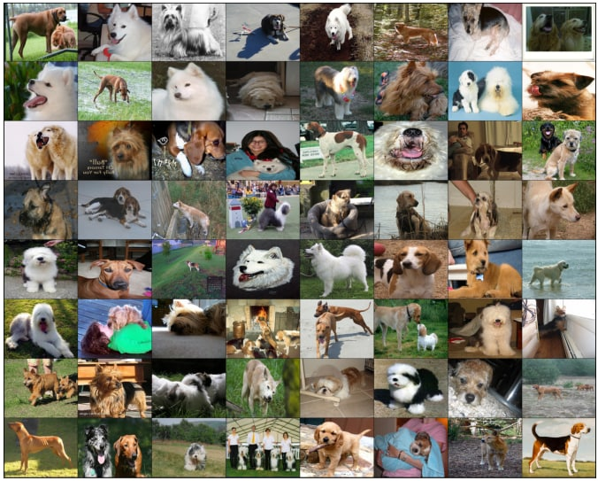

# Dog breed classifier for Imagewoof2 dataset

### Installation
___
Requirements:

- Markdown==3.3.6
- matplotlib==3.5.0rc1
- numpy==1.18.5
- pandas==1.4.3
- Pillow==8.4.0
- pytest==4.6.9
- PyYAML==5.3.1
- scikit-image==0.18.3
- scikit-learn==1.0.1
- scipy==1.4.1
- torch==1.12.0
- torchvision==0.13.0
- typing-extensions==4.0.0
- pyTelegramBotAPI==4.6.1

### Make a model prediction
___
To make a prediction of one image you need to run [pred_img.py](https://github.com/AtMelo/Dog_breeds_classifier/blob/main/pred_img.py)

### About model
___
In this work, a pre-trained resnet34 was taken as a model.
The number of the last fully connected layers was changed and accordingly
trained for the dataset

    Epoch: 11   Training Loss: 0.1542   Validation Loss: 0.1585
    Training Accuracy: 96.01%   Validation Accuracy: 95.57%

    The model has achieved an accuracy of 94.96% on the test dataset